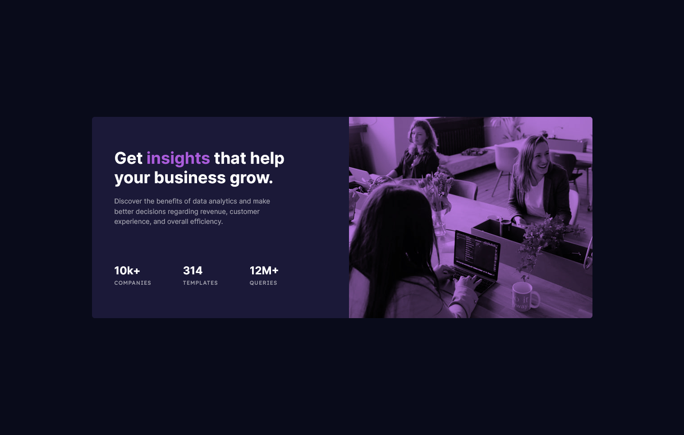

# Frontend Mentor - Stats preview card component solution

This is a solution to the [Stats preview card component challenge on Frontend Mentor](https://www.frontendmentor.io/challenges/stats-preview-card-component-8JqbgoU62). Frontend Mentor challenges help you improve your coding skills by building realistic projects.

## Table of contents

-   [Overview](#overview)
    -   [The challenge](#the-challenge)
    -   [Screenshot](#screenshot)
    -   [Links](#links)
-   [My process](#my-process)
    -   [Built with](#built-with)
    -   [What I learned](#what-i-learned)

## Overview

### The challenge

Users should be able to:

-   View the optimal layout depending on their device's screen size

### Screenshot




### Links

-   Live Site URL: [HERE](https://luxury-fenglisu-de5bff.netlify.app/)

## My process

### Built with

-   Semantic HTML5 markup
-   CSS custom properties
-   Flexbox
-   CSS Grid
-   Desktop-first workflow

### What I learned

Few of the things I learnt include using the picture element to show images based on media queries.

```html
<picture class="card-image-box">
    <source
        srcset="res/images/image-header-desktop.jpg"
        media="(min-width: 66em)"
    />
    
</picture>
```
